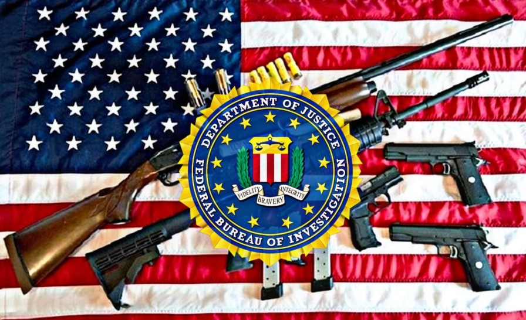

# Project-group-1

## MEMBERS 
    1.Aditya Sharma
    2.Baljit Kaur
    3.Md Ziaur Rahman Jony
    4.Sai Sreenath Tangirala

### TOPIC 
Relation between Firearm Background checks and Gun related deaths in USA.
  
  

| Sr. No. | Task                                     | Notebook and Repositories                                                                                                                                                                                                      |
| ------- | ----------------------------------------- | ----------------------------------------------------------------------------------------------------------------------------------------------------------------------------------------------------------------------------- |
| 1       | Phase 1- Cleaning and processing individual datasets | [Notebook](https://github.com/MQCOMP6200/project-group-1/tree/main/data)  |
| 2       | Phase 2- Analysing Indvidual Data Sets before mearging also to see some trends| [Aditya Sharma](https://github.com/MQCOMP6200/project-group-1/blob/main/Aditya%20Sharma.ipynb) , [Baljit Kaur](https://github.com/MQCOMP6200/project-group-1/blob/main/Baljit%20Kaur.ipynb), [Md Ziaur Rahman Jony](https://github.com/MQCOMP6200/project-group-1/blob/main/MD%20Ziaur%20Rahman%20Jony.ipynb), [Sai Sreenath Tangirala](https://github.com/MQCOMP6200/project-group-1/blob/main/Sreenath%20Tangirala.ipynb)|
| 3       |Phase 3- Mearging datasets together for further analysis| [Notebook](https://github.com/MQCOMP6200/project-group-1/blob/main/Main%20Project%201%20.ipynb)                               |
| 4       | Phase 4- Applying Various machine learning techniques into main project notebook | [Notebook](https://github.com/MQCOMP6200/project-group-1/blob/main/Main%20Analysis%20file.ipynb)                          |
| 5       | Phase 5- Checking for missing or final testing for analysis | [Notebook](https://github.com/MQCOMP6200/project-group-1/blob/main/Main%20Analysis%20file.ipynb)                           |
| 6       | Final submission in Project group 1 Repository| [Repositories](https://github.com/MQCOMP6200/project-group-1)

## Introduction for datasets
`FBI NICS Firearm Background Check Data.`

The NICS conducts background checks on people who want to own a firearm or explosive, as required by law.
When a person tries to buy a firearm, the seller, known as a Federal Firearms Licensee (FFL), contacts NICS electronically or by phone. The prospective buyer fills out the ATF form, and the FFL relays that information to the NICS. The NICS staff performs a background check on the buyer. That background check verifies the buyer does not have a criminal record or isn't otherwise ineligible to purchase or own a firearm. Since launching in 1998, more than 300 million checks have been done, leading to more than 1.5 million denials.The NICS provides full service to the FFLs in 30 states, five U.S. territories, and the District of Columbia. The NICS provides partial service to seven states. The remaining 13 states perform their own checks through the NICS. 
Each column represents the type of transaction submitted to the National Instant Criminal Background Check System (NICS). In addition, each type of transaction is broken down by the type of firearm—handgun, long gun, and other. The types of firearms are defined by the Bureau of Alcohol, Tobacco, Firearms and Explosives as follows:

*  Handgun—(a) any firearm which has a short stock and is designed to be held and fired by the use of a single hand; and (b) any combination of parts from which a firearm described in paragraph (a) can be assembled.

* Long Gun—a weapon designed or redesigned, made or remade, and intended to be fired from the shoulder, and designed or redesigned and made or remade to use the energy of the explosive in (a) a fixed metallic cartridge to fire a single projectile through a rifled bore for each single pull of the trigger; or (b) a fixed shotgun shell to fire through a smooth bore either a number of ball shot or a single 
projectile for each single pull of the trigger.
*  Other—refers to frames, receivers, and other firearms that are neither handguns nor long guns (rifles or shotguns), such as firearms having a pistol grip that expel a shotgun shell, or National Firearms Act firearms, including silencers.
The transaction types indicated in yellow on the chart are for background checks initiated by an officially-licensed Federal Firearms Licensee (FFL) or criminal justice/law enforcement agency prior to the issuance of a firearm-related permit or transfer. The indication of “multiple” denotes a background check where more than one type of firearm is associated to a single background check and “admin” denotes 
the administrative checks that are for other authorized uses of the NICS.
Other types of transactions are explained below:
*  Pre-Pawn—background checks requested by an officially-licensed FFL on prospective firearm transferees seeking to pledge or pawn a firearm as security for the payment or repayment of money, prior to actually pledging or pawning the firearm.
* Redemption—background checks requested by an officially-licensed FFL on prospective firearm transferees attempting to regain possession of a firearm after pledging or pawning a firearm as security at a pawn shop.
* Returned/Disposition—background checks requested by criminal justice/law enforcement agencies prior to returning a firearm in its possession to the respective transferee, to ensure the individual is not prohibited.
* Rentals—background checks requested by an officially-licensed FFL on prospective firearm transferees attempting to possess a firearm when the firearm is loaned or rented for use off the premises of the business.
* Private Sale—background checks requested by an officially-licensed FFL on prospective firearm transferees attempting to possess a firearm from a private party seller who is not an officially-licensed FFL.
* Return to Seller-Private Sale—background checks requested by an officially-licensed FFL on prospective firearm transferees attempting to possess a firearm from a private party seller who is not an officially-licensed FFL. [Source](https://www.fbi.gov/services/cjis/nics)

`Gun Deaths In Usa from 2012-2014`

The datacomes primarily from the Centers for Disease Control and Prevention’s Multiple Cause of Death database, which is derived from death certificates from all 50 states and the District of Columbia and is widely considered the most comprehensive estimate of firearm deaths. In keeping with the CDC’s practice, deaths of non-U.S. residents that take place in the U.S. (about 50 per year) are excluded. All figures are averages from the years 2012 to 2014, except for police shootings of civilians, which are from 2014.Contains variables such as 
* hispanic - values of hispanic in numbers.
* Intent- wether it is a sucide, accidental ,homicide or undetermined.
* Education - Education level of the individual who used the guns.
* Race- which race the individual belong to. 
* Place - where the individual used the firearms.
* Sex - sex of the individual.
. [Source](https://fivethirtyeight.com/features/gun-deaths/)

`Gun Deaths In Usa from 1999-2018`

This dataset is related to Gun-deaths in USA from 1999 to 2018. It was created five years ago. This dataframe gives information about Gun-related deaths by age and sex from 1999-2018 in USA which contains information about
* deaths among different age graoups - < 1 year	1-4 years	5-14 years	15-24 years	25-34 years	35-44 years	45-54 years	55-64 years	65-74 years	75-84 years	85+ years	Not Stated
* Total number of deaths- Ovearall Deaths consisting all the sexes, age groups ,and intent.
* Intent - how the person used the gun by these categories -Undetermined ((a) Undetermined means the intentiality of the deaths (unintentional/preventable, homicide, suicide) was not determined.) ,Suicide,Assault,	Preventable/accidental,Legal intervention
* Sex- wether the individual is male or feamale or both.
[Source](https://web.archive.org/web/20201216175544/https://docs.google.com/spreadsheets/d/e/2PACX-1vSSw6_GoTEqxIiLYTPs8_AmJ1P4DnpEJJYyVw0yAauGOPR72_Rm2RFIZwhgvt3wQQa51hhfMobByRSy/pubhtml)

`Mass Shooting in USA `

This US mass shooting dataset is obtained from an US magazine "Mother Jones" founded in 1976. Mother Jones is an American magazine that focuses on news, commentary, and investigative reporting on topics including politics, the environment, human rights, health and culture. This dataset include a wide range of gun crimes in which four or more people have been either wounded or killed fro the year 1982-2021. This dataset mainly focused on distinct phenomenon—from the firearms used and mental health factors to the growing copycat problem and the data set cosist of following variables
* case- name of the case that happened
* location -location where the incident happened 
* date - date of the incident 
* summary - a short summary of what happened
* fatalities - how many fatalities the incident caused 
* injured - how many people got injured from the shootings 
* location_2 - location of the mass shootings 
* age_of_shooter - age of shooter involved 
* prior_signs_mental_health_issues - any past history of mental signs or illness
and so on.
.[Sources](https://www.motherjones.com/politics/2012/12/mass-shootings-mother).

| Sr. No. | Datasets                                   | Links for Datasets                                                                                                                                                                                                                    |
| ------- | ----------------------------------------- | ----------------------------------------------------------------------------------------------------------------------------------------------------------------------------------------------------------------------------- |
| 1       | FBI NICS Firearm Background Check Data.          | [LINK](https://github.com/BuzzFeedNews/nics-firearm-background-checks)  |
| 2       | Gun-related deaths by age and sex 1999-2018 in USA.     | [LINK](https://web.archive.org/web/20201216175544/https://docs.google.com/spreadsheets/d/e/2PACX-1vSSw6_GoTEqxIiLYTPs8_AmJ1P4DnpEJJYyVw0yAauGOPR72_Rm2RFIZwhgvt3wQQa51hhfMobByRSy/pubhtml)|
| 3       |Gun-related mass shootings in USA from 1982 to 2019 |        [LINK](https://data.world/awram/us-mass-shootings)|
| 4      | Gun-related deaths in USA from 2012 to 2014|          [LINK](https://data.world/azel/gun-deaths-in-america)|

### Refrences

* [Pandas](https://pandas.pydata.org/)
* [Seaborn](https://seaborn.pydata.org/)
* [Matplotlib](https://matplotlib.org/)
* [Scikit](https://scikit-learn.org/)
* [Numpy](https://numpy.org/)
* [Analytics Vidhya](https://www.analyticsvidhya.com/)
* [Geeks For Geeks](https://practice.geeksforgeeks.org/)
* [GitHub](https://github.com/)
* [Kaggle](https://www.kaggle.com/)
* [Stack Overflow](https://stackoverflow.com/)
* [Towards Data Science](https://towardsdatascience.com/)

